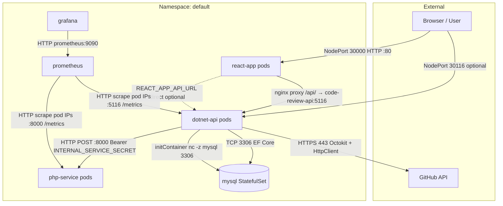

# Infrastructure Hardening — Implementation Plan

> **Project:** CodeReview (`Review_Code`)  
> **Status:** Area 0, Area 1, Area 2, Area 3, and Area 4 (Foundation) IMPLEMENTED.  
> **Audience:** Platform / DevOps engineers extending the existing kind + ArgoCD + GitHub Actions stack toward production-grade security

This plan is grounded in the **actual repository layout** as of analysis. It covers four additions: HashiCorp Vault, Trivy, Kubernetes Network Policies, and Terraform — with explicit ordering for cross-dependencies.

---

## Part A — Codebase Analysis (Current State)

### A.1 Application services

| Service | Path | Language / framework | K8s workload | Image (CI) |
|---------|------|----------------------|--------------|------------|
| **react-app** | `react-app/` | React 19, CRA, nginx | Deployment `react-app` (3 replicas) | `{DOCKER_HUB_USERNAME}/code-review-frontend` |
| **dotnet-api** | `dotnet-api/` | .NET 9 ASP.NET Core, EF Core, JWT, Octokit | Deployment `dotnet-api` (2 replicas) | `{DOCKER_HUB_USERNAME}/code-review-api` |
| **php-service** | `php-service/` | PHP 8.2, Slim 4 | Deployment `php-service` (2 replicas) | `{DOCKER_HUB_USERNAME}/code-review-php` |
| **mysql** | `infrastructure/mysql/DB_Schema.sql` | MySQL 8.0 (official image) | StatefulSet `mysql` (1 replica) | `mysql:8.0` (not built in CI) |

**Observability (in-cluster, not business logic):**

| Component | Path / manifest | Image |
|-----------|-----------------|-------|
| **prometheus** | `k8s/base/monitoring.yaml` | `prom/prometheus:latest` |
| **grafana** | `k8s/base/monitoring.yaml`, `k8s/base/grafana-dashboard-import.yaml` | `grafana/grafana:latest` |

**GitOps / cluster helpers:**

| Component | Path |
|-----------|------|
| **ArgoCD Application** | `k8s/argocd/app-codereview.yaml` |
| **ArgoCD UI NodePort** | `k8s/argocd/argocd-ui.yaml` |
| **kind port mappings** | `kind-config.yaml` |

There is **no** gRPC, message broker, or Redis. Background work uses `System.Threading.Channels` inside `dotnet-api/Services/BackgroundAnalysisProcessor.cs`.

---

### A.2 Inter-service communication (actual traffic paths)



**Evidence in code/manifests:**

| From | To | Mechanism | Source |
|------|-----|-----------|--------|
| Browser | `react-app` | NodePort `30000` → port 80 | `k8s/base/react-app.yaml` |
| `react-app` nginx | `code-review-api:5116` | `proxy_pass` on `/api/` | `react-app/nginx.conf` |
| `react-app` | `dotnet-api:5116` | `REACT_APP_API_URL` in ConfigMap | `k8s/base/react-app.yaml` |
| `dotnet-api` | `mysql:3306` | `DB_HOST=mysql` in `dotnet-config` | `k8s/base/dotnet-api.yaml` |
| `dotnet-api` | `php-service:8000` | `PHP_ANALYSIS_API_URL` | `k8s/base/dotnet-api.yaml`, `PhpServiceClient.cs` |
| `dotnet-api` | GitHub | Outbound HTTPS | `GitHubClientService.cs`, `GitHubFileService.cs` |
| `prometheus` | `dotnet-api`, `php-service` pods | Pod annotation discovery | `k8s/base/monitoring.yaml`, pod annotations in app YAMLs |
| `grafana` | `prometheus:9090` | ConfigMap datasource | `k8s/base/monitoring.yaml` |
| `dotnet-api` init | `mysql:3306` | `busybox` + `nc` | `k8s/base/dotnet-api.yaml` |

**Not present in K8s (only in Docker Compose):** `mysql-exporter` — Compose uses `infrastructure/prometheus/prometheus.yml` static targets; K8s Prometheus uses kubernetes pod SD only.

---

### A.3 Kubernetes manifests structure

All application manifests live in **`k8s/base/`** (flat, no Kustomize):

| File | Resources |
|------|-----------|
| `k8s/base/mysql.yaml` | PVC `mysql-pvc`, Secret `mysql-secret`, StatefulSet `mysql`, headless Service `mysql` |
| `k8s/base/php-service.yaml` | Deployment `php-service`, ClusterIP Service `php-service` |
| `k8s/base/react-app.yaml` | ConfigMap `react-config`, Deployment `react-app`, NodePort Service `react-app` |
| `k8s/base/dotnet-api.yaml` | Secret `dotnet-secrets`, ConfigMap `dotnet-config`, Deployment `dotnet-api`, NodePort `dotnet-api`, ClusterIP `code-review-api` |
| `k8s/base/monitoring.yaml` | SA/ClusterRole/ClusterRoleBinding `prometheus`, Prometheus + Grafana Deployments/Services/ConfigMaps |
| `k8s/base/grafana-dashboard-import.yaml` | ConfigMap `grafana-dashboards-code-review` |

**Missing from repo but referenced:**

- ConfigMap **`mysql-init-schema`** — referenced in `k8s/base/mysql.yaml` volume mount; schema exists at `infrastructure/mysql/DB_Schema.sql` but is not packaged into K8s.

**Not present anywhere in repo:** Ingress, NetworkPolicy, Namespace YAML, HPA, PDB, PodSecurity.

**Namespace:** Everything syncs to **`default`** (`k8s/argocd/app-codereview.yaml`, `CreateNamespace=false`).

---

### A.4 CI/CD pipeline

**Single workflow:** `.github/workflows/ci.yml`

| Job | Trigger | Purpose |
|-----|---------|---------|
| `test-dotnet` | push/PR `main` | `dotnet test` in `dotnet-api/tests` |
| `test-php` | push/PR `main` | `php tests/run_tests.php` (non-fatal on failure: `|| exit 0`) |
| `test-react` | push/PR `main` | `npm test` (non-fatal), production build artifact |
| `build-and-push` | after tests | Matrix build for `dotnet-api`, `php-service`, `react-app` → Docker Hub |
| `update-deploy-branch` | **main only** | Reset `deploy` to `main`, `sed` image tags in three YAMLs, force-push `deploy` |
| `test-summary` | always | GitHub Step Summary gate |

**Image tagging:** `:latest` and `:${{ github.sha }}` on push to `main` (not on PR).

**GitHub secrets today:** `DOCKER_HUB_USERNAME`, `DOCKER_HUB_ACCESS_TOKEN` only.

**Deploy branch updates** touch only:

- `k8s/base/dotnet-api.yaml`
- `k8s/base/php-service.yaml`
- `k8s/base/react-app.yaml`

---

### A.5 GitOps (ArgoCD)

| Setting | Value |
|---------|-------|
| Application | `codereview-app` in namespace `argocd` |
| Source repo | `https://github.com/Taha7486/Review_Code.git` |
| Branch | **`deploy`** (not `main`) |
| Path | **`k8s/base`** |
| Destination | `default` namespace |
| Sync | Automated prune + selfHeal |

ArgoCD itself is installed from upstream manifests (documented in `README.md` / `docs/gitops-implementation-plan.md`), not from this repo.

---

### A.6 Secrets and environment variables (current)

| Secret / config | Location | Keys / data |
|-----------------|----------|-------------|
| `mysql-secret` | `k8s/base/mysql.yaml` (plaintext `stringData` in Git) | `MYSQL_ROOT_PASSWORD`, `MYSQL_DATABASE` |
| `dotnet-secrets` | `k8s/base/dotnet-api.yaml` (plaintext in Git) | `JWT_SECRET_KEY`, `INTERNAL_SERVICE_SECRET`, `GITHUB_PAT` |
| `dotnet-config` | ConfigMap in same file | `DB_HOST`, `DB_PORT`, `DB_NAME`, `DB_USER`, `PHP_ANALYSIS_API_URL`, `ALLOWED_ORIGINS` |
| `react-config` | `k8s/base/react-app.yaml` | `REACT_APP_API_URL` |
| Grafana admin | inline env in `monitoring.yaml` | `GF_SECURITY_ADMIN_PASSWORD=admin` |

**Local/dev template:** `.env.example` at repo root.

**Application-required secrets** (validated in `dotnet-api/Configuration/StartupConfigValidation.cs`): `DB_*`, `JWT_SECRET_KEY`, `PHP_ANALYSIS_API_URL`, `INTERNAL_SERVICE_SECRET`.

**Known gaps:**

1. **`php-service` K8s manifest** does not set `INTERNAL_SERVICE_SECRET` or `APP_ENV` — PHP auth is effectively bypassed when secret is empty or default (`php-service/public/index.php`).
2. **Docker Compose** also omits `INTERNAL_SERVICE_SECRET` on the PHP container (only .NET gets it).
3. **Secrets committed to Git** on both `main` and `deploy` branches — high risk for production.

---

### A.7 Observability

**Kubernetes (`k8s/base/monitoring.yaml`):**

- Prometheus uses **kubernetes_sd_configs** with `role: pod`, keeping pods annotated with `prometheus.io/scrape: "true"`.
- Annotated workloads: `dotnet-api` (`/metrics:5116`), `php-service` (`/metrics:8000`).
- Grafana datasource: `http://prometheus:9090`.
- Dashboard JSON: `k8s/base/grafana-dashboard-import.yaml`.
- Prometheus RBAC: ClusterRole `prometheus` with pod/service/endpoints list + `/metrics` non-resource URL.

**Docker Compose (`docker-compose.yml`, `infrastructure/prometheus/prometheus.yml`):**

- Static scrape of API, PHP, and **mysql-exporter** on port 9104.

**Custom metrics:** `dotnet-api/Services/PrometheusMetricsService.cs`, `php-service/app/Controllers/MetricsController.php`.

---

### A.8 What does not exist yet

| Technology | In-repo status |
|------------|----------------|
| Terraform | No `*.tf` files |
| HashiCorp Vault | Not referenced in manifests |
| Trivy | Not in CI |
| NetworkPolicy | None |
| External Secrets / Sealed Secrets | Mentioned only in `docs/gitops-implementation-plan.md` as future guidance |

---

## Part B — Target Architecture & Responsibility Split

### B.1 Terraform vs ArgoCD

| Layer | Owner | Examples |
|-------|-------|----------|
| **Cluster / platform infrastructure** | **Terraform** | Namespaces, platform RBAC, dedicated ServiceAccounts, NetworkPolicies, Vault server (Helm), Vault Secrets Operator (VSO), Vault auth backends & policies, VSO `VaultConnection` / auth |
| **Application runtime** | **ArgoCD** (GitOps, `deploy` branch) | Deployments, Services, ConfigMaps (non-secret), probes, replicas, image tags, app annotations |
| **Application secrets consumption** | **Hybrid** | Vault paths & policies in Terraform; per-app `VaultStaticSecret` (or equivalent) can live in Git under `k8s/base/` **without secret values** — only references to Vault paths |

**Rule:** Terraform state must not fight ArgoCD over the same fields. Use one of:

- **Annotation-based exclusion:** `argocd.argoproj.io/compare-options: IgnoreExtraneous` on Terraform-managed resources, or
- **Separate paths:** e.g. `terraform/` applies platform; `k8s/base/` stays application-only; NetworkPolicies and Vault CRDs in `k8s/platform/` synced by a second ArgoCD Application **or** applied only by Terraform.

**Recommended for this repo:** Terraform owns `k8s/platform/` resources (or a dedicated `platform/` manifest set applied by Terraform), ArgoCD continues to own `k8s/base/` application manifests.

### B.2 Recommended implementation order (cross-cutting)

```
Phase 0: Remediate known gaps (mysql-init-schema, php-service env)
    ↓
Phase 1: Terraform bootstrap (provider, backend, namespaces, SAs)     ←──┐
    ↓                                                                      │ parallel
Phase 2: Install Vault + VSO via Terraform                              ←──┘
    ↓
Phase 3: Vault K8s auth, policies, migrate secrets off Git
    ↓
Phase 4: Trivy in CI (can start after Phase 0; independent of Vault)
    ↓
Phase 5: NetworkPolicies (Terraform) — after namespaces/labels stable
    ↓
Phase 6: Terraform hardening, ArgoCD path split, production cutover
```

**Why Vault before NetworkPolicies:** Policies may need to allow Vault/VSO control-plane traffic; secret rotation must work before locking down egress.

**Why Trivy early:** No cluster dependency; improves supply chain immediately.

---

## Part C — Step-by-Step Implementation Plan

---

### Area 0 — Prerequisites & gap remediation (do first)

#### Step 0.1 — Fix MySQL schema bootstrap in Kubernetes

**What:** Create ConfigMap `mysql-init-schema` from `infrastructure/mysql/DB_Schema.sql` (as documented in `docs/gitops-implementation-plan.md` but never committed).

**Why:** `k8s/base/mysql.yaml` mounts `mysql-init-schema`; without it, MySQL starts with an empty DB and `dotnet-api` migrations may fail or behave inconsistently.

**Where:** New manifest in `k8s/base/` (ArgoCD-owned) **or** Terraform `kubernetes_config_map` if you want schema versioned outside app sync.

**Risk:** Existing PVC may already be initialized without schema — may require PVC delete/recreate in dev only.

**Dependency:** None; blocks reliable end-to-end testing of later steps.

---

#### Step 0.2 — Align `php-service` secrets with .NET

**What:** Add `INTERNAL_SERVICE_SECRET` (from Vault/K8s secret later) and `APP_ENV=production` to `k8s/base/php-service.yaml`, matching `.env.example` and `php-service/public/index.php` auth middleware.

**Why:** Today `dotnet-secrets` sets `INTERNAL_SERVICE_SECRET` for .NET only; PHP does not receive it in K8s, so service-to-service auth is not enforced in the cluster.

**Where:** `k8s/base/php-service.yaml`; mirror fix in `docker-compose.yml` for local parity.

**Risk:** After this fix, .NET→PHP calls will 401 if secrets mismatch — verify both services read the same Vault path.

**Dependency:** Step 0.2 can use a temporary K8s Secret; fully corrected in Vault migration (Area 1).

---

#### Step 0.3 — Introduce a dedicated application namespace

**What:** Plan migration from `default` to e.g. `codereview` (application) and keep `argocd`, `vault` separate.

**Why:** NetworkPolicies and RBAC are namespace-scoped; running in `default` is an anti-pattern for policy enforcement.

**Where:** Terraform module `modules/namespace` (Area 4); update `k8s/argocd/app-codereview.yaml` `destination.namespace` and `syncOptions: CreateNamespace=true` when ready.

**Risk:** ArgoCD sync will recreate resources in the new namespace — plan a maintenance window or blue/green sync.

**Dependency:** Required before NetworkPolicies (Area 3) and before Vault roles bound to namespace-scoped SAs.

---

#### Step 0.4 — Add consistent labels for policy selectors (COMPLETED)

**What:** Ensure every pod template has labels: `app`, `component` (e.g. `frontend`, `api`, `analyzer`, `database`, `monitoring`), and `part-of: codereview`.

**Why:** NetworkPolicies in Area 3 select on labels; current manifests only use `app: <name>`.

**Where:** All files in `k8s/base/*.yaml` (ArgoCD).

**Risk:** Label changes trigger rolling restarts — acceptable.

**Dependency:** Before Area 3; can be done in parallel with Area 1.

**Verified (2026-06-12):** All ten pods in `codereview` namespace confirmed running with `app`, `component`, and `part-of: codereview` labels after deploying main@897aa49b to deploy branch. See decision log for deploy-lag and prometheus SA issues encountered during this verification.

---

### Area 1 — HashiCorp Vault (secrets management)

#### Step 1.1 — Choose injection mechanism (COMPLETED)

**What:** Adopt **Vault Secrets Operator (VSO)** as the primary integration, with optional **Vault Agent Injector** later for file-based secrets.

**Why (grounded in this repo):**

- Workloads already use `envFrom` + `secretRef` (`k8s/base/dotnet-api.yaml`, `react-app.yaml`).
- VSO can materialize native K8s Secrets from Vault with minimal application code change.
- Agent Injector requires pod annotation changes and sidecar lifecycle management on all three app Deployments.

**Risk:** VSO adds CRDs and an operator deployment — must be installed before app `VaultStaticSecret` resources.

**Dependency:** Vault server must exist (Step 1.2).

---

#### Step 1.2 — Deploy Vault via Terraform (COMPLETED)

**What:**

1. Add `terraform/` at repo root with Helm provider targeting the cluster.
2. Install Vault in namespace `vault` (dev: Helm chart with file storage or dev mode; prod: HA + persistent storage + auto-unseal — out of scope for kind, document once the production platform is selected).

**Why:** Vault is platform infrastructure; aligns with B.1 responsibility split.

**Where:** `terraform/modules/vault/` — Helm release, namespace, basic readiness checks.

**Risk:**

- **kind:** Dev-mode Vault is acceptable for learning; data is ephemeral.
- **Unseal keys:** Never commit to Git; store in CI/CD or a production-grade key management system for real environments.
- ArgoCD must **not** manage the Vault server Deployment to avoid state fights.

**Dependency:** Terraform bootstrap (Area 4, Step 4.1); cluster admin credentials.

---

#### Step 1.3 — Deploy Vault Secrets Operator via Terraform (COMPLETED)

**What:** Install VSO Helm chart in `vault` (or `vso-system`) namespace; configure `VaultConnection` pointing at in-cluster Vault service.

**Why:** Operator is prerequisite for `VaultStaticSecret` CRs.

**Where:** `terraform/modules/vault-secrets-operator/`.

**Risk:** VSO version must match Vault version compatibility matrix — pin chart versions in Terraform.

**Dependency:** Step 1.2.

---

#### Step 1.4 — Enable Kubernetes auth in Vault (COMPLETED)

**What:**

1. Enable `auth/kubernetes` on Vault.
2. Configure token reviewer JWT (use dedicated Terraform-created SA with `system:auth-delegator`).
3. Create a **cluster-scoped** or per-namespace auth role mapping.

**Why:** Pods authenticate as their Kubernetes ServiceAccount — no long-lived tokens in Git.

**Where:** `terraform/modules/vault-auth/` using Vault provider resources.

**Risk:** Incorrect `audience`, `issuer`, or CA config causes auth failures — test with `vault write auth/kubernetes/login` from a debug pod.

**Dependency:** Step 1.2; Step 0.3 (namespace) for binding paths.

---

#### Step 1.5 — Create per-service ServiceAccounts (COMPLETED)

**What:** Create dedicated SAs and bind Vault roles:

| Service | K8s SA (proposed) | Vault policy (least privilege) | Secret paths (proposed KV v2) |
|---------|-------------------|-------------------------------|------------------------------|
| `dotnet-api` | `sa-dotnet-api` | read `secret/data/codereview/dotnet-api/*` | `jwt`, `internal-service`, `github-pat`, `db-password` |
| `php-service` | `sa-php-service` | read `secret/data/codereview/php-service/*` | `internal-service` |
| `mysql` | `sa-mysql` | read `secret/data/codereview/mysql/*` | `root-password`, `database` |
| `grafana` | `sa-grafana` | read `secret/data/codereview/grafana/*` | `admin-password` |
| `prometheus` | (existing `prometheus` SA) | no Vault secrets needed | — |
| `react-app` | `sa-react-app` | none (only public config) | — |

**Why:** Least privilege — PHP cannot read JWT or GitHub PAT.

**Where:** `terraform/modules/service-accounts/`; update Deployments in `k8s/base/` to set `serviceAccountName` (ArgoCD).

**Risk:** Changing SA on running Deployments restarts pods — coordinate with secret migration.

**Dependency:** Steps 1.4, 0.3, 0.4.

---

#### Step 1.6 — Seed Vault secrets and define policies (COMPLETED)

**What:**

1. Create KV v2 mount `secret/` (if not default).
2. Write secrets migrated from current Git values (rotate all values during migration — do not copy production passwords from `k8s/base/mysql.yaml` or `dotnet-api.yaml`).
3. Define Vault policies and roles per Step 1.5 table.

**Why:** Replaces plaintext `stringData` in `mysql-secret` and `dotnet-secrets`.

**Where:** `terraform/modules/vault-secrets/` for policies/roles; initial secret values via `vault kv put` in bootstrap script or Terraform `vault_generic_secret` (avoid state containing plaintext in prod — use `lifecycle { ignore_changes }` or external data source).

**Risk:** **Critical** — Terraform state may contain secret values if stored carelessly. Use remote state encryption and exclude secret payloads from state where possible.

**Dependency:** Step 1.4.

---

#### Step 1.7 — Create VaultStaticSecret resources (COMPLETED)

**What:** For each app secret currently in Git:

1. Add `VaultStaticSecret` (VSO) CRs referencing Vault paths — **no secret values in YAML**.
2. Configure `destination` to create K8s Secrets with the **same names** existing Deployments expect: `dotnet-secrets`, `mysql-secret` (or rename and update `secretRef` in one coordinated change).

**Why:** Minimizes changes to `envFrom` / `secretKeyRef` in `k8s/base/dotnet-api.yaml` and `mysql.yaml`.

**Where:** New directory `k8s/platform/secrets/` synced by ArgoCD **or** applied by Terraform — pick one owner (recommended: ArgoCD for CRs, Terraform for operator/Vault server).

**Risk:** Race on first sync — VSO must create Secrets before Deployments mount them. Use ArgoCD sync waves:

```yaml
argocd.argoproj.io/sync-wave: "-1"  # VaultStaticSecret
argocd.argoproj.io/sync-wave: "0"   # Deployments
```

**Dependency:** Steps 1.3, 1.6.

---

#### Step 1.8 — Remove secrets from Git (COMPLETED)

**What:**

1. Delete `Secret` resources with `stringData` from `k8s/base/dotnet-api.yaml` and `k8s/base/mysql.yaml` (keep ConfigMaps).
2. Remove Grafana plaintext password from `k8s/base/monitoring.yaml` — source from Vault via VSO.
3. Add CI check (e.g. `gitleaks` or `trufflehog`) to prevent re-committing secrets.

**Why:** `deploy` branch is ArgoCD source of truth — secrets in Git defeat Vault.

**Where:** Files above; update `docs/gitops-implementation-plan.md` security section.

**Risk:** **Ordering** — must only merge after Step 1.7 is verified in cluster. Keep a rollback branch.

**Dependency:** Steps 1.7, 1.6.

---

#### Step 1.9 — Rotate compromised credentials

**What:** Rotate every value that ever appeared in Git: MySQL root password, JWT key, `INTERNAL_SERVICE_SECRET`, `GITHUB_PAT`, Grafana admin.

**Why:** Values in `k8s/base/mysql.yaml` and `dotnet-api.yaml` are in Git history permanently.

**Risk:** Downtime if rotation not coordinated — rotate DB password and update Vault + VSO + restart .NET in one window.

**Dependency:** Step 1.8.

---

#### Step 1.10 — GitHub Actions secrets for CI (unchanged scope, document boundary)

**What:** Keep `DOCKER_HUB_*` in GitHub Secrets; do **not** put application runtime secrets in GitHub unless needed for integration tests. Document that runtime secrets live only in Vault.

**Why:** CI today only needs registry credentials (`.github/workflows/ci.yml`).

**Optional:** Add GitHub OIDC → Vault for pipeline secrets later (out of initial scope).

**Dependency:** None.

---

### Area 2 — Trivy (container image scanning)

#### Step 2.1 — Add a `scan-images` job to CI (COMPLETED)

**What:** New job in `.github/workflows/ci.yml` that runs after images are built (or builds locally on PR without push).

**Why:** Scan every service image on push and PR as requested.

**Where:** `.github/workflows/ci.yml` — matrix matching `build-and-push` services:

- `dotnet-api` → `./dotnet-api`
- `php-service` → `./php-service`
- `react-app` → `./react-app`

**Dependency:** None for PRs (build without push); for `main`, can `needs: [build-and-push]` and scan pushed tags **or** scan from local `docker load` before push to avoid race.

**Risk:** PRs do not push images today — must `docker build` in scan job (duplicate build) or use `docker/build-push-action` with `push: false` + `load: true`.

---

#### Step 2.2 — Configure severity threshold (COMPLETED)

**What:** Use `aquasecurity/trivy-action` (or CLI) with:

```text
--severity CRITICAL
--exit-code 1
```

Optionally warn on `HIGH` without failing (`--exit-code 0` + separate summary).

**Why:** Meets “block on CRITICAL” requirement without blocking all HIGH in early adoption.

**Risk:** Base images (`mcr.microsoft.com/dotnet/aspnet:9.0`, `nginx:alpine`, `php:8.2-cli-alpine`) may have CRITICAL CVEs — team may need `trivyignore` or image bumps. Document exception process in `docs/`.

**Dependency:** Step 2.1.

---

#### Step 2.3 — Store scan reports as artifacts (COMPLETED)

**What:** Upload SARIF and/or JSON per matrix service:

```yaml
uses: actions/upload-artifact@v4
with:
  name: trivy-${{ matrix.service }}
  path: trivy-results.${{ matrix.service }}.sarif
```

**Why:** Audit trail and PR review without re-running scans.

**Where:** `.github/workflows/ci.yml`.

**Risk:** Artifact retention limits — set retention days in workflow.

**Dependency:** Step 2.1.

---

#### Step 2.4 — Integrate with `test-summary` job (COMPLETED)

**What:** Add `scan-images` to `test-summary` `needs` and fail the pipeline if CRITICAL vulnerabilities exist.

**Why:** Single gate for “merge safe” status on PRs.

**Where:** `.github/workflows/ci.yml` job `test-summary`.

**Risk:** PHP/React tests currently use `|| exit 0` — pipeline may report green tests but red security; document in summary.

**Dependency:** Steps 2.1–2.3.

---

#### Step 2.5 — (Optional) Scan MySQL and monitoring images (SKIPPED)

**What:** Add a secondary matrix for `mysql:8.0`, `prom/prometheus:latest`, `grafana/grafana:latest` with `trivy image` (no Dockerfile in repo).

**Why:** These run in cluster from `k8s/base/mysql.yaml` and `monitoring.yaml` but are not built in CI.

**Risk:** `latest` tags are non-reproducible — pin digests in manifests as a follow-up.

**Dependency:** None.

---

#### Step 2.6 — Update deploy-branch workflow awareness (COMPLETED)

**What:** Ensure Trivy runs on `main` **before** `update-deploy-branch` promotes SHA-tagged images to `deploy`.

**Why:** `update-deploy-branch` only runs on `main` after `build-and-push`; vulnerable images must not reach ArgoCD.

**Where:** `ci.yml` — `update-deploy-branch.needs: [build-and-push, scan-images]` with `if: success()`.

**Risk:** First CRITICAL findings may block all deploys until images are patched — expected behavior.

**Dependency:** Steps 2.1–2.4.

---

### Area 3 — Kubernetes Network Policies

#### Step 3.1 — Confirm CNI supports NetworkPolicy (COMPLETED)

**What:** Verify the target cluster CNI enforces policies (kind default supports it; confirm the equivalent network policy support for the chosen production platform).

**Why:** Policies are no-ops without a supporting CNI.

**Risk:** kind + NodePort external access behavior differs from production Kubernetes platforms — test on both local and production-like clusters.

**Dependency:** Step 0.3 (dedicated namespace).

**Verified (2026-06-12):** Calico v3.29.0 running in kind cluster; kindnet disabled. `calico-node` and `calico-kube-controllers` pods both Running 1/1 in `kube-system`. NetworkPolicy enforcement confirmed active.

---

#### Step 3.2 — Document the allowed traffic matrix (source of truth) (COMPLETED)

**What:** Encode the matrix below as comments in policy Terraform module README.

| Source label | Destination | Port | Direction |
|--------------|-------------|------|-----------|
| `app=react-app` | `app=dotnet-api` (via `code-review-api` Service) | 5116/TCP | egress from react → api |
| `app=dotnet-api` | `app=mysql` | 3306/TCP | egress |
| `app=dotnet-api` | `app=php-service` | 8000/TCP | egress |
| `app=dotnet-api` | world (GitHub) | 443/TCP | egress — use ipBlock or `egress: {}` with domain rules if CNI supports it |
| `app=prometheus` | pods with `prometheus.io/scrape=true` | annotated port | ingress to targets from prometheus |
| `app=grafana` | `app=prometheus` | 9090/TCP | egress |
| `app=dotnet-api` (init) | `app=mysql` | 3306/TCP | egress (initContainer shares pod network — same policy as dotnet-api pod) |
| kube-dns | all pods | 53/UDP+TCP | egress to `kube-system` |
| VSO operator | Vault | 8200/TCP | egress (if operator in app namespace) |

**Not in cluster today:** react → php (deny), php → mysql (deny), php → dotnet (deny).

**Where:** `terraform/modules/network-policies/README.md` and `docs/k8s-architecture.md` update.

**Dependency:** Step 0.4 labels.

---

#### Step 3.3 — Apply default-deny baseline (Terraform) (COMPLETED)

**What:** In namespace `codereview`, create:

1. `NetworkPolicy` **default-deny-ingress** — all pods, no ingress rules.
2. `NetworkPolicy` **default-deny-egress** — all pods, no egress rules.

**Why:** Explicit allow policies then open only required paths.

**Where:** `terraform/modules/network-policies/policies-default-deny.tf`.

**Risk:** **Immediate outage** if applied without allow policies in the same apply — use Terraform `depends_on` or single module apply with deny + allows together.

**Dependency:** Steps 3.2, 0.3.

---

#### Step 3.4 — Allow DNS egress (all app pods) (COMPLETED)

**What:** Policy permitting egress to `kube-system` namespace on port 53 UDP/TCP to pods labeled `k8s-app: kube-dns` (label varies by cluster — discover on target cluster).

**Why:** Without DNS, `mysql`, `php-service`, `dotnet-api` service discovery breaks.

**Risk:** Wrong DNS selector breaks all traffic — validate with `nslookup` from debug pod.

**Dependency:** Step 3.3.

---

#### Step 3.5 — Application allow policies (COMPLETED)

**What:** Create scoped policies (Terraform), one file per flow:

- `allow-react-to-api.yaml` → react-app → code-review-api:5116
- `allow-api-to-mysql.yaml` → dotnet-api → mysql:3306
- `allow-api-to-php.yaml` → dotnet-api → php-service:8000
- `allow-api-egress-github.yaml` → dotnet-api → `0.0.0.0/0:443` (tighten to GitHub IP ranges or use egress gateway in prod)
- `allow-grafana-to-prometheus.yaml` → grafana → prometheus:9090

**Where:** `terraform/modules/network-policies/policies-app.tf`.

**Risk:** `react-app` nginx targets **`code-review-api`** ClusterIP (`react-app/nginx.conf`), not `dotnet-api` Service name — policy must allow traffic to pods labeled `app=dotnet-api` (both Services select same pods).

**Dependency:** Steps 3.3, 3.4.

---

#### Step 3.6 — Prometheus scraping policy (COMPLETED)

**What:** Ingress policy on **scraped pods** (`dotnet-api`, `php-service`):

```text
ingress from:
  podSelector: app=prometheus
  ports: 5116 (dotnet), 8000 (php)
```

**Why:** Prometheus in `k8s/base/monitoring.yaml` scrapes **pod IPs** via kubernetes SD, not Service ClusterIP. Traffic is pod-to-pod from `app=prometheus` to `app=dotnet-api` / `app=php-service`.

**Where:** `terraform/modules/network-policies/policies-observability.tf`.

**Risk:** If prometheus lacks label `app=prometheus`, policy will block scrapes — verify Deployment labels in `monitoring.yaml`.

**Also allow:** Prometheus egress to API server for SD (443) — may need egress policy on prometheus pod to `kubernetes.default.svc:443`.

**Dependency:** Step 3.5.

---

#### Step 3.7 — Health probe and NodePort considerations (COMPLETED)

**What:**

1. **Probes:** kubelet traffic for `livenessProbe` / `readinessProbe` originates from the node — typically **not** blocked by NetworkPolicy (implemented outside policy in most CNIs). Document and test.
2. **NodePort:** External browser → `react-app` NodePort may still work with deny-all ingress because kube-proxy path is special — **test on kind and the chosen production platform** before relying on policies for perimeter security.
3. For production, plan **Ingress controller** instead of NodePort (`k8s/base` has no Ingress today).

**Why:** NodePort + default-deny is a common footgun.

**Risk:** Mistaken belief that NetworkPolicy replaces firewall — it does not replace edge security.

**Dependency:** Step 3.6.

---

#### Step 3.8 — Vault / VSO network paths (COMPLETED)

**What:** If VSO runs in `vault` namespace and watches `codereview`:

- Allow VSO operator egress to Vault:8200.
- App pods generally **do not** need Vault egress when using VSO-synced K8s Secrets (only the operator talks to Vault).

**Why:** Avoids over-opening dotnet-api to Vault.

**Dependency:** Area 1 complete.

---

#### Step 3.9 — Validate with network policy conformance tests (COMPLETED)

**What:** Run manual checks from temporary debug pods (`kubectl run netshoot`) and confirm:

- `curl` from react pod to API works.
- `curl` from php pod to dotnet fails.
- Prometheus targets show `UP` in UI (`http://localhost:9090/targets` via kind mapping).
- Grafana dashboards load metrics.

**Where:** Document commands in `docs/infrastructure-hardening-plan.md` appendix or `docs/k8s-architecture.md`.

**Dependency:** All policies applied.

---

### Area 4 — Terraform (infrastructure as code)

#### Step 4.1 — Scaffold Terraform layout

**What:** Create repository structure:

```text
terraform/
├── environments/
│   ├── kind/          # local dev
│   └── prod/          # future production target, cloud/platform TBD
├── modules/
│   ├── namespace/
│   ├── service-accounts/
│   ├── rbac/
│   ├── vault/
│   ├── vault-secrets-operator/
│   ├── vault-auth/
│   ├── vault-policies/
│   └── network-policies/
├── backend.tf.example
└── README.md
```

**Why:** Clean module layout as requested; separates local kind variables from future production variables without committing to a cloud provider yet.

**Where:** New `terraform/` directory at repo root.

**Risk:** None.

**Dependency:** None — start early in parallel with Vault planning.

---

#### Step 4.2 — Configure Kubernetes and Helm providers

**What:**

- `provider "kubernetes"` — kubeconfig from env or `KUBE_CONFIG_PATH`.
- `provider "helm"` — same kubeconfig.
- `provider "vault"` — for policies/auth (address + token via env in CI).

**Why:** Vault + VSO are Helm; NetworkPolicies and SAs are raw Kubernetes resources.

**Where:** `terraform/environments/kind/main.tf`.

**Risk:** Terraform needs cluster-admin for CRBs and ClusterRoles — use least privilege SA for routine applies where possible.

**Dependency:** Step 4.1.

---

#### Step 4.3 — Remote state and locking

**What:** Configure a remote backend with locking for the `prod` environment once the production platform is selected; keep local state for kind.

**Why:** Team collaboration and state safety for production.

**Where:** `terraform/environments/prod/backend.tf` when production is defined.

**Risk:** Local state on developer machines must not be used for shared prod.

**Dependency:** Step 4.1.

---

#### Step 4.4 — Module: namespaces

**What:** Terraform creates `codereview`, `vault`, optionally `monitoring` namespaces with labels.

**Why:** Foundation for RBAC, policies, and Vault.

**Where:** `terraform/modules/namespace/`.

**Dependency:** Step 4.2.

---

#### Step 4.5 — Module: service accounts & RBAC

**What:**

- Terraform creates all application and platform ServiceAccounts needed by current workloads.
- Terraform creates Prometheus ClusterRole and ClusterRoleBinding.
- ArgoCD no longer owns Prometheus RBAC resources in `k8s/base/monitoring.yaml`.
- Application manifests set `serviceAccountName` explicitly.

**Why:** Vault K8s auth binds to ServiceAccounts; Prometheus needs cluster-wide pod discovery permissions; RBAC is a platform/security concern and should have one owner.

**Ownership decision:** Terraform owns ServiceAccounts and RBAC. ArgoCD owns the workloads that reference those identities.

**Where:** `terraform/modules/rbac/`, `terraform/modules/service-accounts/`.

**Dependency:** Steps 4.4, 0.3.

---

#### Step 4.6 — Module: Vault + VSO (Area 1 integration)

**What:** Scaffold Terraform module placeholders for Vault, Vault Secrets Operator, Vault Kubernetes auth, and Vault policies. The actual Vault installation, auth configuration, secret paths, and migration are completed in Area 1.

**Why:** Terraform layout is ready before secret-management work starts, while avoiding premature Vault implementation decisions.

**Dependency:** Area 1 Steps 1.2–1.6.

---

#### Step 4.7 — Module: network policies (Area 3 integration)

**What:** Scaffold Terraform module placeholder for NetworkPolicies. The actual default-deny and allow-list policies are completed in Area 3 after Vault/VSO paths and traffic requirements are stable.

**Why:** Policies are infrastructure, not application versioned with image tags, but applying them too early can break the app.

**Dependency:** Area 3 design (Step 3.2); namespace module (4.4).

---

#### Step 4.8 — ArgoCD boundary enforcement

**What:**

1. Keep a single ArgoCD Application, `codereview-app`, for `k8s/base`.
2. Do not create a second ArgoCD platform app.
3. Keep Terraform-owned resources out of ArgoCD-managed paths.
4. Remove deprecated platform resources from `k8s/base`, starting with Prometheus RBAC.
5. Document the ownership boundary in `terraform/README.md`.

**Why:** Prevents drift and sync wars while keeping the repo simple: ArgoCD deploys app runtime; Terraform manages platform/security resources.

**Where:** `k8s/argocd/`, `k8s/base/`, `terraform/README.md`.

**Risk:** Misconfiguration causes ArgoCD and Terraform to fight over the same object. The mitigation is a strict path and ownership split.

**Dependency:** Steps 4.4–4.7, 0.3.

---

#### Step 4.9 — CI for Terraform

**What:** Add `.github/workflows/terraform.yml`:

- `terraform fmt -check`
- `terraform validate`
- `tflint` (optional)
- `terraform plan` on PR (kind environment, read-only)
- `terraform apply` on manual workflow_dispatch or protected branch (not auto-apply to prod initially)

**Why:** IaC changes need review separate from app CI.

**Dependency:** Step 4.1.

---

#### Step 4.10 — Document operator runbooks

**What:** Update `README.md` and `docs/k8s-architecture.md` with:

- `terraform apply` order for new clusters
- ArgoCD sync after platform layer
- Vault unseal / backup procedures
- How to add a new service secret path

**Why:** Onboarding and incident response.

**Dependency:** All areas complete.

---

#### Step 4.11 — Dedicated grafana VaultAuth binding (TODO from Area 3)

**What:** Currently `k8s/base/vault-static-secrets.yaml` uses `dotnet-api-vault-auth` for the grafana `VaultStaticSecret`. This means `sa-dotnet-api`'s Vault role can read grafana admin credentials — violates least privilege. Fix requires:

1. Create a new Vault role `grafana-role` bound to `sa-grafana` in `terraform/environments/kind/main.tf` (`module.vault_auth.roles`).
2. Create a new Vault policy `codereview-grafana` in `terraform/modules/vault-policies/main.tf` covering only `secret/data/codereview/grafana/*`.
3. Add a `VaultAuth` CR `grafana-vault-auth` in `terraform/modules/vault-secrets-operator/` (or `k8s/base/vault-static-secrets.yaml`) referencing `grafana-role`.
4. Update the grafana `VaultStaticSecret` in `k8s/base/vault-static-secrets.yaml` to use `vaultAuthRef: grafana-vault-auth`.
5. Seed the grafana Vault secret path with `sa-grafana` SA (currently seeded but readable by dotnet-api's role).

**Why:** `sa-dotnet-api` should never have read access to `secret/data/codereview/grafana/config`. The shared-auth workaround was applied in Area 1 as a quick fix (see operational log Issue 2). This step properly separates the identities.

**Where:** `terraform/modules/vault-policies/main.tf`, `terraform/environments/kind/main.tf`, `terraform/modules/vault-secrets-operator/`, `k8s/base/vault-static-secrets.yaml`.

**Risk:** grafana pod will fail with `CreateContainerConfigError` during the transition if the new `grafana-vault-auth` is not synced before the old `dotnet-api-vault-auth` reference is removed. Sequence: (1) add new role/policy/auth, apply Terraform, verify grafana-secrets refreshes; (2) then update `vault-static-secrets.yaml` to use new auth ref; (3) push to deploy branch.

**Dependency:** Area 1 (Vault infrastructure already in place).

---

## Part D — Consolidated Timeline (suggested sprints)

| Sprint | Focus | Key deliverables |
|--------|-------|------------------|
| 1 | Prerequisites + Trivy | Steps 0.1–0.2, 2.1–2.4 |
| 2 | Terraform bootstrap + namespaces | Steps 4.1–4.5, 0.3–0.4 |
| 3 | Vault + VSO + secret migration | Area 1 Steps 1.1–1.9 |
| 4 | NetworkPolicies | Area 3 Steps 3.1–3.9 |
| 5 | Hardening + docs + production prep | Steps 2.5–2.6, 4.8–4.10, pin image digests |

---

## Part E — Risk register (summary)

| Risk | Impact | Mitigation |
|------|--------|------------|
| Secrets in Git history | Credential leak | Rotate all secrets (Step 1.9); gitleaks in CI |
| ArgoCD vs Terraform ownership overlap | Accidental deletion | Separate paths; sync waves; ignore annotations |
| Default-deny without DNS allow | Total outage | Apply DNS + app allows in same Terraform apply |
| Prometheus scrape blocked | Blind monitoring | Step 3.6 ingress from `app=prometheus` |
| Trivy CRITICAL on base images | Blocked deploys | Pin/digest images; trivyignore with ticket |
| `mysql-init-schema` missing | Broken DB | Step 0.1 |
| PHP secret not mounted | False sense of security | Steps 0.2, 1.7 |
| NodePort ≠ perimeter security | False confidence | Ingress + WAF for prod; document limits (Step 3.7) |
| kind ≠ production behavior | Surprises in migration | Validate on a production-like cluster before prod cutover |
| `deploy` branch force-push | Lost manifest history | Normal for this repo; ensure Vault secrets are not reintroduced by `git reset --hard origin/main` in CI |

---

## Part F — File reference index

| Topic | Primary files |
|-------|---------------|
| CI/CD | `.github/workflows/ci.yml` |
| ArgoCD | `k8s/argocd/app-codereview.yaml` |
| App manifests | `k8s/base/*.yaml` |
| Secrets (to remove) | `k8s/base/dotnet-api.yaml`, `k8s/base/mysql.yaml`, `k8s/base/monitoring.yaml` |
| Service mesh / API client | `dotnet-api/Services/Helpers/PhpServiceClient.cs`, `react-app/nginx.conf` |
| PHP auth | `php-service/public/index.php` |
| Env template | `.env.example` |
| Prometheus (Compose) | `infrastructure/prometheus/prometheus.yml` |
| Prometheus (K8s) | `k8s/base/monitoring.yaml` |
| DB schema | `infrastructure/mysql/DB_Schema.sql` |
| kind ports | `kind-config.yaml` |
| Existing architecture doc | `docs/k8s-architecture.md` |
| Existing GitOps doc | `docs/gitops-implementation-plan.md` |

---

## Appendix — Decision log

| Decision | Choice | Rationale |
|----------|--------|-----------|
| Secret injection | Vault Secrets Operator (primary) | Matches existing `secretRef` / `envFrom` pattern |
| Vault install owner | Terraform | Platform IaC split from ArgoCD apps |
| Namespace | Migrate to `codereview` | Policy + RBAC isolation |
| Trivy gate | CRITICAL only | Balance security vs velocity |
| NetworkPolicy owner | Terraform | Infrastructure layer |
| MySQL exporter in K8s | Optional follow-up | Not in current K8s manifests; add if parity with Compose needed |
| kind CNI | Calico v3.29.0 (replaced kindnet) | kindnet does not enforce NetworkPolicy; required for Area 3 |

---

## Appendix — Operational log (bootstrap issues and fixes)

### 2026-06-12 — New machine bootstrap: kind cluster on Windows

#### Issue 1: deploy branch lag

**What happened:** `origin/deploy` was at `f028f1fb` while `origin/main` was at `897aa49b`. CI had not updated deploy after the linux-machine commit. As a result, ArgoCD was syncing the old manifests: `vault-static-secrets.yaml` missing, inline `stringData` secrets still present, Step 0.4 labels incomplete on some services.

**Fix:** Manually promoted main to deploy with pinned image SHA (`f028f1fb` — the last CI-built tag), matching the CI `sed` substitution pattern:
```
git checkout -b deploy origin/main
sed -i "s|:latest|:f028f1fb589d3ea1f1f81896bc00597c47f1b729|g" k8s/base/{dotnet-api,php-service,react-app}.yaml
git commit && git push origin deploy --force
```
**Trigger:** Run CI on main before starting any new cluster bootstrap to ensure deploy is current.

---

#### Issue 2: Vault policy did not cover grafana secret path

**What happened:** `vault-static-secrets.yaml` uses `dotnet-api-vault-auth` for all three `VaultStaticSecret` resources including grafana, but the `codereview-dotnet-api` Vault policy only covered `secret/data/codereview/dotnet-api/*`. VSO could not read `secret/data/codereview/grafana/config`, so `grafana-secrets` K8s Secret was never created. Grafana pods failed with `CreateContainerConfigError: secret "grafana-secrets" not found`.

**Fix:** Extended `terraform/modules/vault-policies/main.tf` `dotnet_api` policy to also cover `secret/data/codereview/grafana/config`. Applied via `terraform apply -target=module.vault_policies`.

**TODO:** Create a dedicated `sa-grafana` VaultAuth binding with its own Vault role and policy scoped only to grafana paths. The current shared-auth approach violates least-privilege — dotnet-api's SA should not be able to read grafana admin credentials.

---

#### Issue 3: ArgoCD prune deleted Terraform-owned prometheus SA and RBAC

**What happened:** The old deploy branch's `monitoring.yaml` contained `ServiceAccount/ClusterRole/ClusterRoleBinding` for prometheus (ArgoCD-managed). The new deploy branch's `monitoring.yaml` (from main, Step 4.8) removed those resources. ArgoCD's prune policy deleted them. Terraform's `module.service_accounts` and `module.prometheus_rbac` had created equivalent resources, but ArgoCD's prune deleted them because they still carried the ArgoCD tracking annotation from the old sync.

**Symptoms:** New prometheus RS `668bf9d7b8` stuck at `CURRENT=0` with `FailedCreate: serviceaccount "prometheus" not found`.

**Fix:** `terraform apply -target=module.service_accounts -target=module.prometheus_rbac` recreated all three resources. Then `kubectl rollout restart deployment/prometheus` forced the RS to retry pod creation with the now-present SA.

**Why this won't recur:** The new `monitoring.yaml` does not declare these resources, so ArgoCD no longer tracks them. Future syncs will not touch them. Terraform is now the sole owner.

**Prevention:** When removing a resource from an ArgoCD-managed manifest that Terraform also manages, run `terraform apply` for the affected module immediately after the ArgoCD sync completes (before pods start failing).

---

---

### 2026-06-12 — Area 3 NetworkPolicies implemented

**What was applied:** All 11 `NetworkPolicy` resources in the `codereview` namespace, owned by Terraform (`terraform/modules/network-policies/main.tf`). Applied atomically in a single `terraform apply -target=module.network_policies` call. No window where default-deny existed without DNS allow.

**Resources created:**
```
default-deny-all, allow-dns-egress, allow-react-app-ingress,
allow-react-app-egress, allow-dotnet-api-ingress, allow-dotnet-api-egress,
allow-mysql-ingress, allow-php-service-ingress, allow-prometheus-egress,
allow-prometheus-ingress, allow-grafana-egress
```

**Conformance test results (kubectl exec, 2026-06-12):**

| Path | Expected | Result |
|------|----------|--------|
| react-app → dotnet-api:5116 | ALLOWED | HTTP 503 response ✓ |
| react-app → php-service:8000 | BLOCKED | timeout ✓ |
| dotnet-api → php-service:8000 | ALLOWED | `{"status":"ok"}` ✓ |
| php-service → mysql:3306 | BLOCKED | timeout ✓ |
| php-service → dotnet-api:5116 | BLOCKED | timeout ✓ |
| mysql → dotnet-api:5116 | BLOCKED | ETIMEDOUT ✓ |
| grafana → prometheus:9090 | ALLOWED | "Prometheus Server is Healthy." ✓ |
| prometheus → dotnet-api:5116/metrics | ALLOWED | Prometheus target UP ✓ |
| DNS (all pods) | ALLOWED | nslookup resolves ✓ |
| NodePort localhost:3000 | ALLOWED | React HTML served ✓ |

**Post-apply cluster state:** All 10 pods Running 1/1, ArgoCD Synced/Healthy, VSO secrets intact (dotnet-secrets, mysql-secret, grafana-secrets all present).

**Design notes:**
- Prometheus port-80 probes time out (correct — NetworkPolicy blocks non-5116 ports on dotnet-api)
- php-service /metrics returns 401 (pre-existing app auth issue, not NetworkPolicy; traffic IS reaching php-service)
- Kubelet liveness/readiness probes exempt from NetworkPolicy enforcement in Calico on kind

**Outstanding TODO:** Create dedicated grafana VaultAuth binding with its own Vault role; current setup uses `dotnet-api-vault-auth` for grafana VSS which violates least-privilege.

---

*End of plan — implementation code and manifests to be added in subsequent work items per area.*
